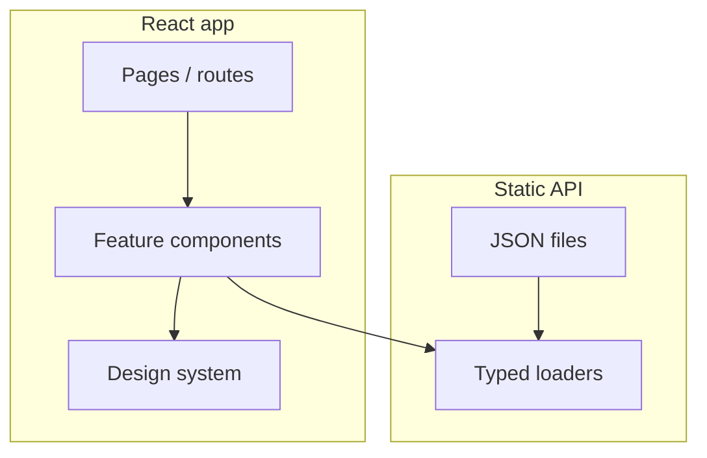

# Architecture

## System context



## Directory layout

```
src/
  design-system/       # tokens, primitives, layouts
  components/          # shared recipe UI (cards, lists, meta)
  features/            # optional: grouped flows (search, favorites)
  pages/               # route entrypoints — thin composition only
  static-api/
    data/              # *.json recipe catalog
    loaders/           # fetch + parse + map to domain types
    types/             # Recipe, Ingredient, etc.
  test/                # shared test helpers, fixtures
```

## Domain model (minimum)

- `Recipe`: id, slug, title, description, imageUrl, prepMinutes, cookMinutes, servings, ingredients[], steps[], tags[]
- `Ingredient`: amount, unit, name
- List endpoints: all recipes, by slug, by tag (implemented as loader filters over static data)

## Layer rules

| Layer | May import | Must not |
|-------|------------|----------|
| `design-system` | tokens only | features, pages, static-api |
| `components` | design-system, types | pages |
| `features` | components, design-system, loaders | — |
| `pages` | features, components | implement business logic inline |
| `static-api` | types | React |
